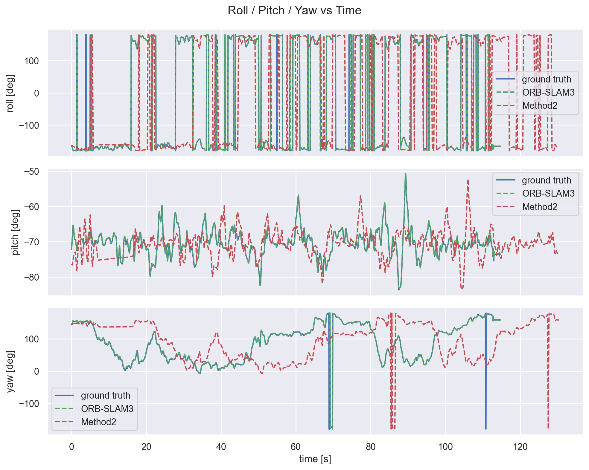
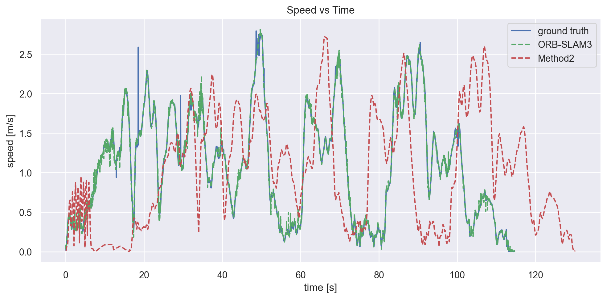
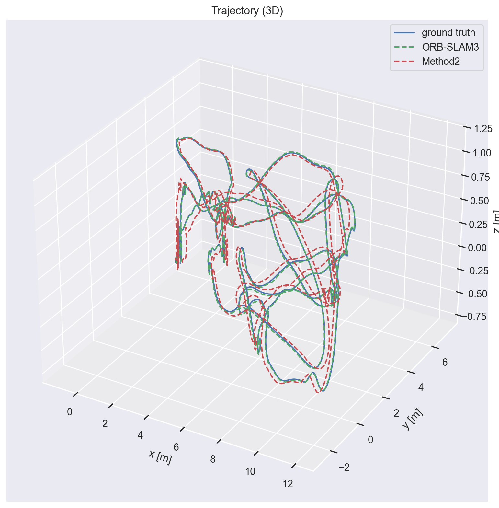
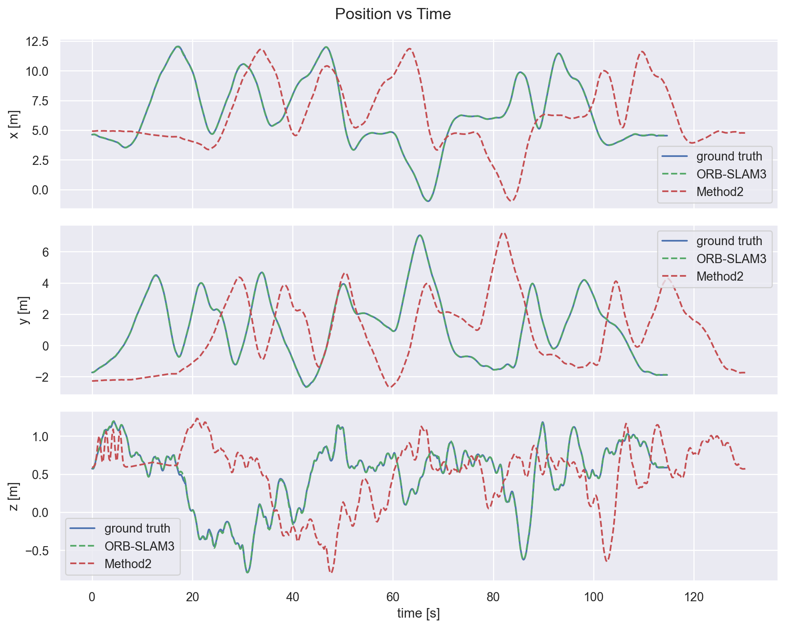

# Ego VIO XR

We aim to build a visual odometry, visual-inertial odometry, and SLAM evaluation and development framework that supports widely used datasets and tools.

Below are plots of the trajectories for MH_03_medium from the EuRoC dataset, which is a medium difficulty sequence. The plots show the roll, pitch, yaw (RPY), speeds, 3D trajectory, and XYZ coordinates of the estimated trajectory compared to the reference trajectory evaluated with evo. The ORB-SLAM3 results are in blue and the Kimera VIO results are in orange:
<table>
  <tr>
    <td align="center">
      <br>
      <sub>MH_03_medium RPY</sub>
    </td>
    <td align="center">
      <br>
      <sub>MH_03_medium Speed</sub>
    </td>
  </tr>
  <tr>
    <td align="center">
      <br>
      <sub>MH_03_medium Trajectory 3D</sub>
    </td>
    <td align="center">
      <br>
      <sub>MH_03_medium XYZ</sub>
    </td>
  </tr>
</table>

### Tools:
- Language: Python
- SLAM systems evaluated: ORB-SLAM3, Kimera VIO
- Datasets: EuRoC, Lamaria, inhouse data
- Infrastructure: Docker, Rerun
- Evaluation metrics: ATE, RPE, scale drift

### Installation

```bash
python3 -m venv .venv
source .venv/bin/activate
pip install -r requirements.txt

python3 ./run_euroc.py --log-level INFO
```

### Running Tests

```bash
pytest
```

### Results

The sequences below are from the EuRoC dataset, and the metrics are computed using evo_traj with SE(3) alignment of the ORB-SLAM estimate to the reference trajectory before computing metrics. The RMSE, mean, median, std, min, and max are in meters.

### APE translation metrics by sequence

| Sequence | ORB-SLAM3 RMSE (m) | ORB-SLAM3 Mean (m) | ORB-SLAM3 Median (m) | ORB-SLAM3 Std (m) | Kimera RMSE (m) | Kimera Mean (m) | Kimera Median (m) | Kimera Std (m) |
|---|---:|---:|---:|---:|---:|---:|---:|---:|
| MH_01_easy | 0.0416 | 0.0382 | 0.0434 | 0.0164 | 0.2209 | 0.1944 | 0.1589 | 0.1050 |
| MH_02_easy | 0.0306 | 0.0252 | 0.0190 | 0.0173 | 0.2190 | 0.1813 | 0.1583 | 0.1229 |
| MH_03_medium | 0.0267 | 0.0235 | 0.0226 | 0.0127 | 0.2301 | 0.2042 | 0.1792 | 0.1060 |
| MH_04_difficult | 0.0452 | 0.0374 | 0.0280 | 0.0254 | 167.2937 | 140.3258 | 123.9163 | 91.0816 |
| MH_05_difficult | 0.0656 | 0.0570 | 0.0465 | 0.0325 | 0.1650 | 0.1499 | 0.1384 | 0.0690 |

### Min/max APE translation error by sequence

| Sequence | ORB-SLAM3 Min (m) | ORB-SLAM3 Max (m) | Kimera Min (m) | Kimera Max (m) |
|---|---:|---:|---:|---:|
| MH_01_easy | 0.0030 | 0.0857 | 0.0572 | 0.5064 |
| MH_02_easy | 0.0039 | 0.0931 | 0.0037 | 0.5887 |
| MH_03_medium | 0.0017 | 0.1036 | 0.0596 | 0.5787 |
| MH_04_difficult | 0.0012 | 0.1857 | 21.0674 | 459.1591 |
| MH_05_difficult | 0.0044 | 0.1711 | 0.0204 | 0.3022 |

### Winner by RMSE

There is Kimera VIO failure on MH_04_difficult, which is a difficult sequence with fast motion and low lighting. ORB-SLAM3 performs better on all sequences, with a large gap in RMSE on MH_04_difficult due to the Kimera failure.

| Sequence | Better method | RMSE gap (m) |
|---|---|---:|
| MH_01_easy | ORB-SLAM3 | 0.1794 |
| MH_02_easy | ORB-SLAM3 | 0.1884 |
| MH_03_medium | ORB-SLAM3 | 0.2034 |
| MH_04_difficult | ORB-SLAM3 | 167.2486 |
| MH_05_difficult | ORB-SLAM3 | 0.0994 |
